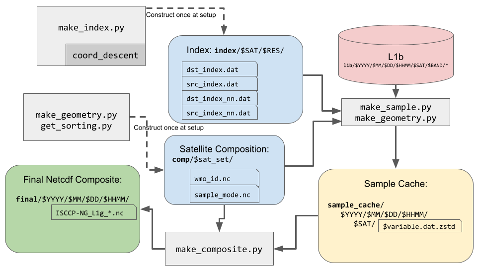

# ISCCP L1g Prototype

The ISCCP Level-1G (L1G) dataset is a composition of imagery from all advanced geostationary imagers into homogeneous and globally gridded fields.
Sensor overlap is handled using a layering scheme similar to that of the NOAA/NESDIS GridSat product.
The L1G is intended to be the input for ISCCP-NG L2, but can also be a resource for applications needing geostationary data.
The provisional approach is to include all channels every 30 minutes with a maximum resolution of 4 km on a Equirectangular grid.

## Getting Started

Make a working directory
```bash
mkdir test_install
```

Make a tar dir and a dat dir
```bash
cd test_install
mkdir tar dat
```

Download into `tar/`
  - [isccp_l1g.tar](https://ftp.ssec.wisc.edu/ISCCP-NG/code/isccp_l1g.tar)
  - [example_l1b.tar.gz](https://ftp.ssec.wisc.edu/ISCCP-NG/code/example_l1b.tar.gz)
  - [index.tar.gz](https://ftp.ssec.wisc.edu/ISCCP-NG/code/index.tar.gz)

Extract index into `dat/`, this is an index I made beforehand to save time. You can make your own in an hour with `make_index.py`
```bash
tar -C dat -xvf tar/index.tar.gz
```
```bash
# load docker image
docker load -i tar/isccp_l1g.tar

# run docker image
docker run -it --rm -v $PWD:/host -u root isccp_l1g /bin/bash -l
```

Inside the docker container, the following command will run the example.
This uses the example L1b data in `tar/example_l1b.tar.gz` and the index in `dat/index/`.
```bash
source get_started.sh
```


## Processing Outline



* By default directories (`l1b/`,`index/`,`final/`, etc) are created under `dat/`, make this a symlink to a larger storage area if needed.
* shorthand for each satellite is defined in `utils.py` (e.g. `g16`, `h8`, `m11`, etc)

## Construct Index (`make_index.py`)

The first step is to construct the resampling index for each satellite (using `make_index.py`).
To do this we need at least one granule of data to provide the coordinates of the satellite pixels.
We assume the data is fix-grid. This step only needs to be done once for each resolution of each sensor.
This step requires lots of RAM, recommend at least 32GB. It takes about an hour

<details><summary><b>Example</b></summary>

```bash
# Try to create an index for every satellite in utils.py:ALL_SATS
python make_index.py 2020-07-01
...
ls dat/index/g16/refl_00_47um/
    dst_index.dat  src_index.dat dst_index_nn.dat  src_index_nn.dat
```

</details>

## Make Geometry (`make_geometry.py`)

This step makes the satellite zenith and azimuth angles for each pixel in the final grid (using `make_geometry`).
It is expected that these can change so it should be run every timestep.
The zenith angle is compared between satellites to decide which layer to put the pixel in.
That sorting is intended to be fixed over long periods of time. So run it at least once on a representative timestep.

<details><summary><b>Example</b></summary>

```bash
python make_geometry.py g16 2020-07-01
...
ls dat/sample_cache/2020/07/01/0000/g16/
    satellite_azimuth_angle.dat.zstd  satellite_zenith_angle.dat.zstd
```

</details>

## Freeze Sorting (`get_sorting.py`)

This step determines how many layers are needed in the output and which satellite goes in each layer as well as when the sampling mode is averaged or nearest-neighbor.
This depends on the satellite composition.
It is expected that this will be fixed over long periods of time, so it should be run once on a representative timestep.

<details><summary><b>Example</b></summary>

```bash
python get_sorting.py g16,g17,h8,m8,m11 2020-07-01
...
ls dat/comp/g16_g17_h8_m11_m8/
    sample_mode.nc  wmo_id.nc
```

</details>

## Resampling Data (`make_sample.py`)

This step reads L1b data for one band of one satellite and resamples it to the final grid and then saves it to disk in an intermediate format. This intermediate format is very similar to the final netcdf format.
Floating point data is converted into packed-integers and compressed.
The `temp_11_00um` and `refl_00_65um` bands are special in that statistics are computed for them.

<details><summary><b>Example</b></summary>

```bash
python make_sample.py --compdir dat/comp/g16_g17_h8_m11_m8 g16 temp_11_00um 2020-07-01
...
ls dat/sample_cache/2020/07/01/0000/g16/
    temp_11_00um.dat.zstd
    temp_11_00um_count.dat.zstd
    temp_11_00um_max.dat.zstd
    temp_11_00um_min.dat.zstd
    temp_11_00um_std.dat.zstd
```

</details>

## Make Timing (`make_timing.py`)

This step makes the pixel-level timing.
Line-level times are stored in l1b for Himawari-8 and Meteosat-8/11, but not for GOES-16/17.
Timing for GOES-16/17 is estimated from a static scan schedule in ancillary files.
By default, the 11 micron l1b is used to estimate the timing for all bands.
The output is a `pixel_time.dat.zstd` file in `sample_cache`

<details><summary><b>Example</b></summary>

```bash
python make_timing.py --compdir dat/comp/g16_g17_h8_m11_m8/ g16 2020-07-01
...
ls dat/sample_cache/2020/07/01/0000/g16/
    pixel_time.dat.zstd
```

</details>

## Composite (`make_composite.py`)

This step reads the intermediate files and shuffles the data into the final netcdf format.
Only sampled variables are compositable ([see list](#variables)) 

<details><summary><b>Example</b></summary>

```bash
python make_composite.py -w dat/comp/g16_g17_h8_m11_m8/wmo_id.nc temp_11_00um 2020-07-01
...
ls dat/final/2020/07/01/0000/
    ISCCP-NG_L1g_demo_v2_res_0_05deg__temp_11_00um__20200701T0000.nc
```

</details>

## Make Ancil (`make_ancil.py`)

`wmo_id` and `sample_mode` are ancillary variables that are mostly static, but we make them for each timestep anyway.

<details><summary><b>Example</b></summary>

```bash
python make_ancil.py --compdir dat/comp/g16_g17_h8_m11_m8/ 2020-07-01
...
ls dat/final/2020/07/01/0000/
    ISCCP-NG_L1g_demo_v2_res_0_05deg__wmo_id__20200701T0000.nc
    ISCCP-NG_L1g_demo_v2_res_0_05deg__sample_mode__20200701T0000.nc
```

</details>

## Make Solar (`make_solar.py`)

This step makes the solar zenith and azimuth angles for each pixel in the final grid.

<details><summary><b>Example</b></summary>

```bash
python make_solar.py 2020-07-01
...
ls dat/final/2020/07/01/0000/
    ISCCP-NG_L1g_demo_v2_res_0_05deg__solar_azimuth_angle__20200701T0000.nc
    ISCCP-NG_L1g_demo_v2_res_0_05deg__solar_zenith_angle__20200701T0000.nc
```

</details>

## L1b

* The level 1b data should be organized into the following directory structure:
```
YYYY/
  MM/
    DD/
      HHMM/
        $SAT/
          $BAND/
            <files>
```
* So far only GOES ABI `.nc`, AHI `.dat`, and MSG HRIT files have been tested, but any format that can be read by `satpy` should work with some modifications to the `utils.py` file.

## Variables

* Sampled
  - refl_00_47um
  - refl_00_51um
  - refl_00_65um
    - refl_00_65um_count
    - refl_00_65um_max
    - refl_00_65um_min
    - refl_00_65um_std
  - refl_00_86um
  - refl_01_38um
  - refl_01_60um
  - refl_02_20um
  - temp_03_80um
  - temp_06_20um
  - temp_06_70um
  - temp_07_30um
  - temp_08_60um
  - temp_09_70um
  - temp_10_40um
  - temp_11_00um
    - temp_11_00um_count
    - temp_11_00um_max
    - temp_11_00um_min
    - temp_11_00um_std
  - temp_12_00um
  - temp_13_30um
  - satellite_zenith_angle
  - satellite_azimuth_angle
* Generated on grid
  - wmo_id
  - pixel_time
  - sample_mode
  - solar_zenith_angle
  - solar_azimuth_angle
